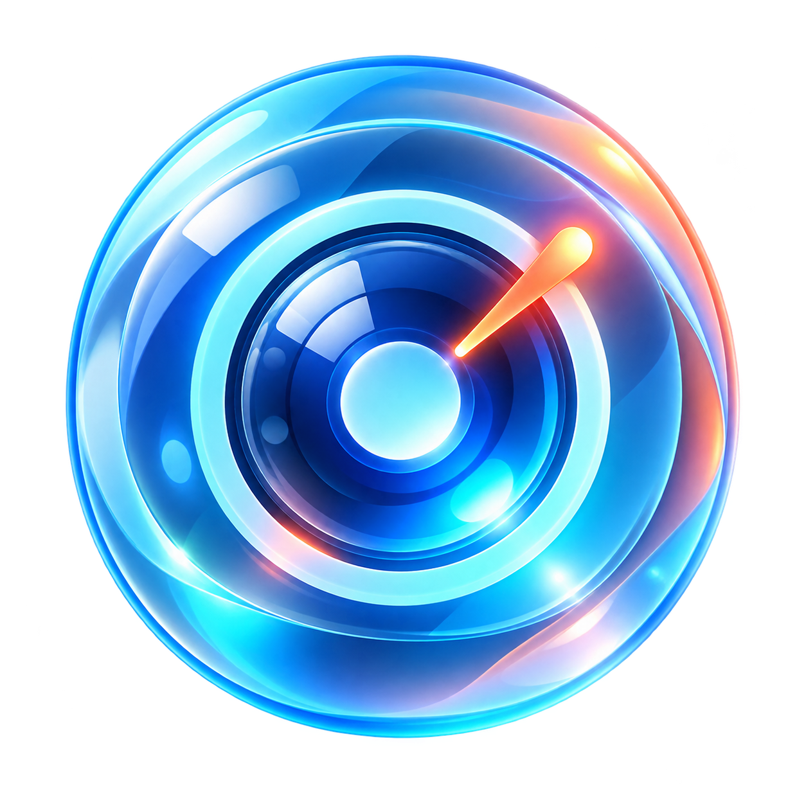

# Moment



Moment is a native Windows capture app for quick text and voice notes. It runs independently, writes Markdown and WebM directly into a selected workspace folder, and can be used alongside any compatible Markdown editor without requiring that editor to be open.

## What it does

- Captures text and voice globally, including F13-F24 and Stream Deck keys.
- Creates one recurring note for each calendar day and appends timestamped entries safely.
- Records compact WebM/Opus audio and optionally transcribes it locally with Whisper.
- Routes voice output to the recurring note, a separate transcript note, or both.
- Runs from the Windows notification tray and can start with Windows.
- Ships as a traditional per-user NSIS `.exe` installer.

## Optional workspace compatibility

Moment does not require editor metadata. If a selected workspace contains `.obsidian/daily-notes.json`, Moment can read its recurring-note folder, filename format, and template. If `.obsidian/plugins/periodic-notes/data.json` contains an enabled recurring provider, Moment can read that provider instead. These files are read-only and optional; without them, Moment uses its own built-in defaults.

## Build and verify

```powershell
npm run verify
```

This builds the native WinUI 3 app and runs the disposable-workspace smoke test. The manual plan is intentionally separate and has not been executed.

To create the real Windows installer:

```powershell
npm run package:app
```

The finished installer is `Moment.App/dist/MomentSetup-x64.exe`.

See [Moment.App/README.md](Moment.App/README.md) for native build, installer, data-location, and compatibility details.

Moment is made by [neura-neura](https://github.com/neura-neura/Moment).
